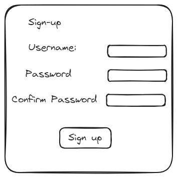
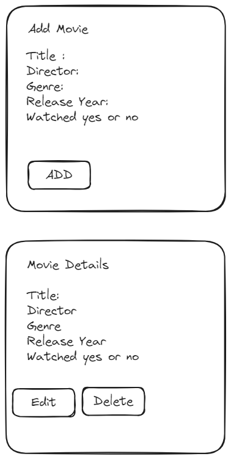
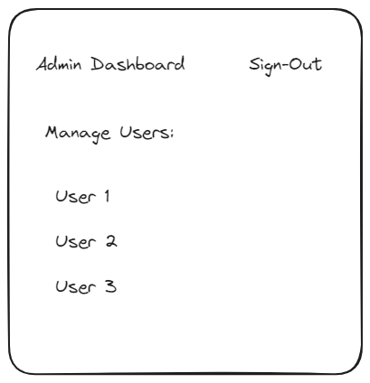
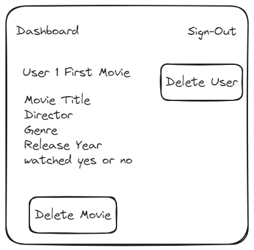

# Movie Collector

### User Stories:

#### User Authentication and Roles:

1. Sign Up:
    - As a new user, I want to create an account with my username, password, and optionally as an admin, so that I can manage movies and users.
2. Sign In:
    - As a registered user or admin, I want to log in with my username and password to access my account.
3. Sign Out:
    - As a logged-in user or admin, I want to log out to ensure my account remains secure.

#### Movie Management for Regular Users:

1. Add Movie:
    - As a logged-in user, I want to add a new movie to my collection by providing details like title, director, genre, and release year.
2. View Movies:
    - As a logged-in user, I want to see a list of movies in my collection.
3. View Movie Details:
    - As a logged-in user, I want to view the details of a specific movie in my collection.
4. Edit Movie:
    - As a logged-in user, I want to edit the details of a movie in my collection.
5. Delete Movie:
    - As a logged-in user, I want to delete a movie from my collection.
6. Mark Movie as Watched/Unwatched:
    - As a logged-in user, I want to mark a movie as watched or unwatched.

#### Admin Management:

1. Manage Users:
    - As an admin, I want to view and delete user accounts.
2. Manage Movies:
    - As an admin, I want to view and delete any user movies in the system.

### ER diagrams

### Wireframe

### ***Technologies Used:***

* HTML/CSS: Basic structure and styling.

* JavaScript: logic and interactivity.

* 