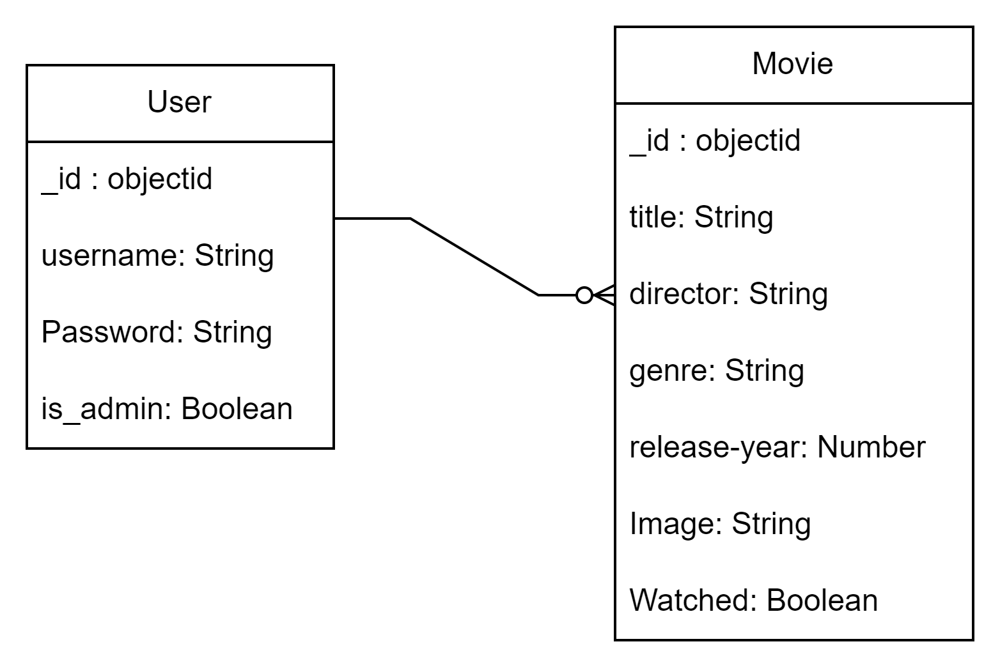

# Movie Collector

Welcome to the Movie Collector application! This application allows users to manage their movie collections by adding, viewing, editing, and deleting movies. Administrators can manage user accounts and movie collections across the platform.

## User Stories

### Regular Users

1. **Sign Up**

   - **As a new user**, I want to sign up for an account so that I can start managing my movie collection.
   - **Acceptance Criteria**:
     - Enter a username and password.
     - Receive confirmation upon successful registration.
     - Receive an error message if the username is already taken.

2. **Sign In**

   - **As a registered user**, I want to sign in to my account so that I can access and manage my movie collection.
   - **Acceptance Criteria**:
     - Enter username and password.
     - Redirect to dashboard after successful login.
     - Receive an error message if credentials are incorrect.

3. **View Movies**

   - **As a signed-in user**, I want to view my movie collection so that I can see all the movies I have added.
   - **Acceptance Criteria**:
     - See a list of movies with details like title, director, genre, and year.
     - View a message if the collection is empty.

4. **Add New Movie**

   - **As a user**, I want to add a new movie to my collection to track movies I’ve watched or want to watch.
   - **Acceptance Criteria**:
     - Provide details like title, director, genre, year, and watched status.
     - Upload an image for the movie.
     - Redirect to movie collection page after adding.

5. **Edit Movie Details**

   - **As a user**, I want to edit movie details to update information or correct mistakes.
   - **Acceptance Criteria**:
     - Change details such as title, director, genre, year, and watched status.
     - Update movie image if needed.
     - Redirect to updated movie details page after saving.

6. **Delete Movie**
   - **As a user**, I want to delete a movie from my collection if I no longer want to keep it.
   - **Acceptance Criteria**:
     - Remove a movie from the collection.
     - Redirect to movie collection page after deletion.

### Administrators

1. **View All Users**

   - **As an admin**, I want to view a list of all users to manage user accounts effectively.
   - **Acceptance Criteria**:
     - See a list of all users with their usernames.
     - Click on a user’s name to view more details.

2. **View User Details**

   - **As an admin**, I want to view details of a specific user, including their movie collection, for better management.
   - **Acceptance Criteria**:
     - See detailed information about the selected user and their movie collection.

3. **Delete User**

   - **As an admin**, I want to delete a user account to remove inactive or unwanted users from the system.
   - **Acceptance Criteria**:
     - Delete a user and all associated movies.
     - Remove the user from the list of users.

4. **Delete Movie from Any User**
   - **As an admin**, I want to delete a movie from any user's collection to manage movies across the platform.
   - **Acceptance Criteria**:
     - Remove a movie from any user's collection.
     - Update the user's collection accordingly.

## Features

- **User Registration and Authentication**: Users can sign up, sign in, and manage their own movie collections.
- **Movie Management**: Users can add, view, edit, and delete movies in their collection.
- **Admin Dashboard**: Admins can view all users, manage user accounts, and delete movies from any user's collection.
- **File Uploads**: Upload movie images associated with movie entries.

### ER diagrams

### Wireframe

### ***Screenshots***:

### **_Technologies Used:_**

- Node.js: JavaScript runtime for server-side development.
- Express.js: Web framework for building the server.
- MongoDB: NoSQL database for storing user and movie data.
- Mongoose: ODM (Object Data Modeling) library for MongoDB and Node.js.
- EJS: Templating engine for rendering HTML views.
- bcrypt: Library for hashing passwords.
- multer: Middleware for handling file uploads.
